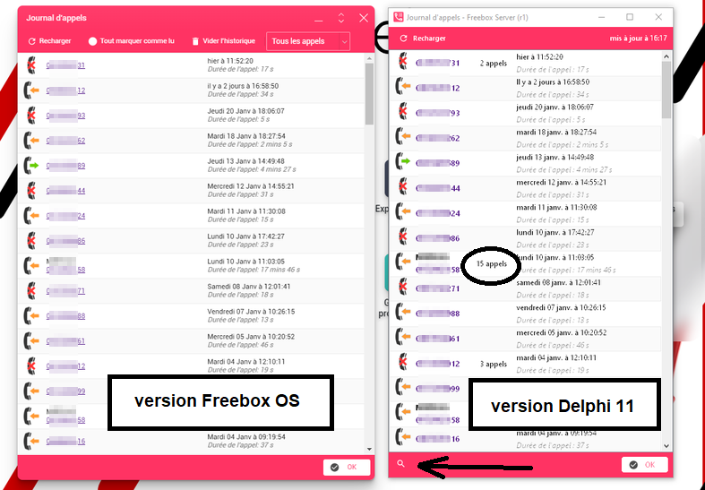

# FreeboxOS - Journal d'appels

Cette application développée sous Embarcadero Delphi 11 permet de consulter le journal d'appels de la Freebox.

L'application reprend le look de l'interface web de Freebox OS 4.5.

Un double clic sur une entrée lance automatiquement la page https://www.numeroinconnu.fr

Pour utiliser l'application, il faut être sur le réseau d'une Freebox et autoriser l'application sur le panneau de la Freebox lors du premier lancement.
Par la suite, un fichier INI conserve l'identifiant lui permettant d'accéder à la Freebox.

Vous pouvez révoquer cet accès depuis l'interface Web de la Freebox : Paramètres de la Freebox / Divers / Gestion des accès, Onglet "Applications".

La version Delphi indique le nombre d'appels pour un numéro donné, et offre une zone de recherche par nom, numéro ou date d'appel.